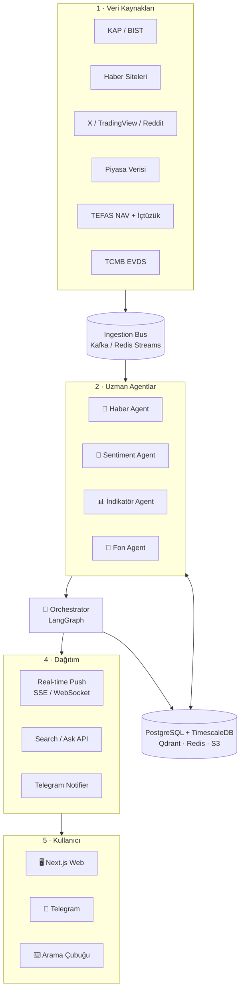

# BIST + TEFAS Çoklu Agent Finansal İstihbarat Platformu

**Tam Teknik Pipeline ve Mimari Dokümantasyonu — v2**

> Bu sistem **yatırım tavsiyesi vermez**. Amacı, kullanıcıyı borsa ve fonlar hakkında bilgilendirmek; karar verme sürecinde aydınlatmaktır. Her çıktıda "Yatırım tavsiyesi değildir" disclaimer'ı zorunludur.

---

## İçindekiler

1. [Vizyon ve Ürün Çerçevesi](#1-vizyon-ve-ürün-çerçevesi)
2. [Yüksek Seviye Mimari](#2-yüksek-seviye-mimari)
3. [Agentlar — Detaylı Spesifikasyon](#3-agentlar--detaylı-spesifikasyon)
   - 3.1 Haber Agent
   - 3.2 Sentiment Agent
   - 3.3 İndikatör Agent
   - 3.4 Fon Agent (TEFAS)
   - 3.5 Orchestrator Agent
4. [Veri Akışı ve Olay Modeli](#4-veri-akışı-ve-olay-modeli)
5. [Teknoloji Yığını](#5-teknoloji-yığını)
6. [Veri Kaynakları ve Lisanslama](#6-veri-kaynakları-ve-lisanslama)
7. [Anlık (Real-time) Mekanizma](#7-anlık-real-time-mekanizma)
8. [Telegram Bildirim Sistemi](#8-telegram-bildirim-sistemi)
9. [Web Arayüzü Tasarımı](#9-web-arayüzü-tasarımı)
10. [Yasal Uyumluluk](#10-yasal-uyumluluk)
11. [Maliyet Tahmini](#11-maliyet-tahmini)
12. [MVP Yol Haritası](#12-mvp-yol-haritası)
13. [Riskler ve Azaltma](#13-riskler-ve-azaltma)
14. [Repo İskeleti (Monorepo)](#14-repo-i̇skeleti-monorepo)
15. [Veritabanı Şemaları](#15-veritabanı-şemaları)
16. [API Endpoint Sözleşmesi](#16-api-endpoint-sözleşmesi)
17. [Örnek JSON Çıktılar](#17-örnek-json-çıktılar)
18. [LLM Prompt Örnekleri](#18-llm-prompt-örnekleri)
19. [Observability ve İzleme](#19-observability-ve-i̇zleme)
20. [Güvenlik](#20-güvenlik)
21. [Test Stratejisi](#21-test-stratejisi)
22. [Sözlük](#22-sözlük)

---

## 1. Vizyon ve Ürün Çerçevesi

### 1.1 Bir Cümleyle

Borsa İstanbul'da işlem gören şirketler ve TEFAS yatırım fonları için **haber + yatırımcı yorumu + teknik gösterge + fon verisi** üreten dört uzman agent'ı bir orchestrator ile birleştiren; sonuçları **anlık yenilenen web arayüzü** ve **Telegram bildirimi** olarak sunan multi-agent platform.

### 1.2 Ürün Hedefleri

- Kullanıcıyı borsa ve fonlar hakkında bilgilendirmek; karar verme sürecini hızlandırmak.
- Her hisse için tek tıkla 360° görünüm (haber + sosyal + teknik).
- Her TEFAS fonu için detaylı kart (NAV, getiri, risk, portföy dağılımı, içtüzük).
- Anlık yenilenen dashboard ile kritik gelişmeleri kullanıcıya iletmek.
- Önemli sinyaller oluştuğunda Telegram üzerinden mobil bildirim göndermek.
- Doğal dil arama çubuğundan (örn. `"TLY fonu nedir?"`, `"THYAO bu hafta neden düştü?"`) yanıt üretmek.

### 1.3 Açıkça Hariç Tutulanlar

- Al / sat / tut tavsiyesi (yatırım danışmanlığı kapsamına girer).
- Hedef fiyat veya kâr beklentisi paylaşımı.
- Fon karşılaştırmasında "daha iyi / en iyi" ifadesi — yalnızca sayısal sıralama.
- Kişiselleştirilmiş yatırım stratejisi üretimi.

### 1.4 Hedef Kullanıcı

Borsayı ve fonları takip eden bireysel yatırımcı; günde 5-15 dk uygulamada vakit geçiren, mobil bildirimle güncel kalmak isteyen kullanıcı.

### 1.5 Başarı Metrikleri (KPI)

- DAU/MAU oranı ≥ 0.35.
- Watchlist ortalama büyüklüğü ≥ 5 hisse + 2 fon.
- Telegram bildirim tıklama oranı (CTR) ≥ %18.
- Arama çubuğu kullanıcı başına günlük ≥ 1.5 sorgu.
- Disclaimer'a rağmen ihlal eden çıktı oranı ≤ %0.1 (manuel denetim örneklemi).

---

## 2. Yüksek Seviye Mimari

### 2.1 Beş Katman

| Katman | Bileşen | Görev |
|---|---|---|
| 1 · Veri | KAP, BIST, haber siteleri, X/Twitter, TradingView, TEFAS, TCMB | Ham veri toplama |
| 2 · Ingestion | Kafka / Redis Streams + Pydantic modelleri | Normalize + ticker / fon kodu etiketleme |
| 3 · Uzman Agent | Haber, Sentiment, İndikatör, Fon (4 ayrı agent) | Domain analizleri |
| 4 · Orchestrator | LangGraph tabanlı yönetici agent | Birleştirme + skorlama + uyarı |
| 5 · Dağıtım | FastAPI WebSocket/SSE, REST, Telegram Bot, Next.js UI | Kullanıcıya teslim |

### 2.2 Tasarım İlkeleri

- **Olay tabanlı (event-driven):** Hiçbir agent diğerini doğrudan çağırmaz; mesaj bus üzerinden konuşur.
- **Stateless agent + stateful state-store:** Tüm durum PostgreSQL + Redis'te; agent'lar yatay ölçeklenir.
- **Tek yönlü veri akışı:** Veri → Ingestion → Agent → Orchestrator → Dağıtım. Geriye çağrı yok.
- **Disclaimer her seviyede:** Sistem prompt, çıktı filtresi, UI ve Telegram footer'ında zorunlu.
- **Açıklanabilirlik:** Her uyarı için "neden tetiklendi?" gerekçesi saklanır (audit log).

### 2.3 Komponent İletişimi (Mermaid Diagramı)



---

## 3. Agentlar — Detaylı Spesifikasyon

### 3.1 Haber Agent (News Agent)

**Sorumluluk:** KAP açıklamaları ve finans haber kaynaklarını anlık tarar; ticker bazlı normalize edip etki skoru çıkarır.

**Girdiler:**
- KAP açıklama feed'i (60 sn polling)
- AA Finans, Bloomberg HT, Dünya, Investing.com Türkçe, Foreks RSS
- Reuters/Bloomberg uluslararası API (opsiyonel premium)

**İşlem adımları:**
1. Haber metnini al → dil tespiti → temizle (HTML, reklam, tracker).
2. NER ile şirket adlarını ve ticker'ları eşle (THY → THYAO sözlüğü, fuzzy matching).
3. Kategori sınıflandır: bilanço, M&A, temettü, yönetim değişikliği, regülasyon, makro, dava, üretim duruşu.
4. Claude Sonnet ile 2-3 cümlelik tarafsız özet üret.
5. Etki skoru hesapla (0-100): `source_credibility × category_weight × recency × novelty`.
6. PostgreSQL'e yaz, Qdrant'a embedding kaydet, Redis bus'a `agent.news_event` yayınla.

**Çalışma frekansı:** KAP 60 sn, RSS 2-5 dk, webhook destekleyenler gerçek zamanlı.

**Bağımlılıklar:** `feedparser`, `trafilatura`, `spacy` (NER), `anthropic` SDK.

---

### 3.2 Sentiment Agent (Yatırımcı Yorumu Analizi)

**Sorumluluk:** Her ticker için sosyal mecralardaki yatırımcı yorumlarını toplar, etkileşim ve sentiment skorunu hesaplar, en çok konuşulan içerikleri öne çıkarır.

**Kaynaklar:**
- X (Twitter) API v2 — cashtag (`$THYAO`) + şirket adı sorguları
- TradingView Türkiye ideas/comments scraper
- Reddit `r/BorsaIstanbul`, `r/Turkey`
- Foreks / Mynet / Bloomberg HT forum sayfaları
- Ekşi Sözlük başlık eşleme (opsiyonel)

**İşlem adımları:**
1. Yorum metnini topla; bot/spam filtresi uygula (yeni hesap, frekans, repeat content, link spam).
2. Etkileşim skoru: `weighted(like, reply, quote, view)` — kaynak başına normalize.
3. Sentiment: Claude Haiku ile 3 sınıf (pozitif/nötr/negatif) + güven skoru.
4. Konu kümeleme: BERTopic veya LLM clustering ile günlük tema tespiti.
5. Influence rank: `follower_count × historical_accuracy_score`.
6. Top-N yorum listesi üret; UI cache'le.

**Manipülasyon savunması:**
- Yeni hesap + yüksek frekans + tek hisse spam paterni → otomatik ban.
- Etkileşim / takipçi oranı anomalisi → düşük ağırlık.
- Coordinated inauthentic behavior tespiti (aynı zaman aralığı, benzer ifade).

**Çalışma frekansı:** 5 dk döngü, ticker başına ayrı task.

---

### 3.3 İndikatör Agent (Teknik Analiz)

**Sorumluluk:** Her hisse için OHLCV verisini alıp 12+ teknik göstergeyi hesaplar, anomalileri tespit eder ve eğitici / tarafsız bir yorum üretir.

**Hesaplanan göstergeler:**

| Kategori | Gösterge |
|---|---|
| Trend | SMA(20/50/200), EMA(12/26), Ichimoku Bulutu, Süpertrend |
| Momentum | RSI(14), MACD(12,26,9), Stochastic(14,3,3), CCI(20) |
| Volatilite | Bollinger(20,2), ATR(14), Keltner Kanalı |
| Hacim | OBV, Volume MA, MFI(14), VWAP |
| Yapısal | Pivot S/R, fraktal S/R, trendline, formasyon (W/M, omuz-baş-omuz) |

**LLM yorum üretimi:**
- Sayısal göstergeleri prompt'a ekle, Claude'dan tarafsız paragraf iste.
- Dil: `"RSI 72 ile aşırı alım bölgesinde"` (tespit). `"Sat"` yok.
- Çıktıya zorunlu disclaimer eklenir.

**Çalışma frekansı:** Seans içi 60 sn, seans dışı 1 saat.

**Bağımlılıklar:** `pandas-ta` veya `TA-Lib`, `pandas`, `numpy`.

---

### 3.4 Fon Agent (TEFAS Fon Analizi)

**Sorumluluk:** TEFAS üzerinde işlem gören yatırım fonlarının (örn. **TLY**) NAV, portföy dağılımı, getiri ve risk metriklerini toplar; fon kartları ve karşılaştırmalı listeler üretir. **Yatırım tavsiyesi vermez.**

**Girdiler:**
- TEFAS Public Bilgi Sunumu (`tefas.gov.tr`) — günlük NAV, fon büyüklüğü, yatırımcı sayısı, ISIN, kategori
- Fon İçtüzüğü + Bilgilendirme Dokümanı (PDF) — KAP fon bölümü
- Portföy Yönetim Şirketi (PYŞ) açıklamaları — İş Portföy, Ak Portföy, Garanti Portföy, QNB Portföy
- SPK kategori standartları, Morningstar TR kategori eşlemesi
- Benchmark veri — BIST 100, KYD endeksleri, MSCI TR

**Her fon için hesaplanan metrikler:**

| Grup | Metrikler |
|---|---|
| Getiri | 1A, 3A, 6A, YBB, 1Y, 3Y, 5Y, kuruluştan beri (kümülatif + yıllık bileşik) |
| Risk | Standart sapma (annualized), max drawdown, VaR(95), downside deviation |
| Risk-getiri | Sharpe, Sortino, Information Ratio (benchmark'a göre), Calmar Ratio |
| Maliyet | Yönetim ücreti, toplam gider oranı (TGO), giriş/çıkış komisyonu |
| Yapı | Portföy dağılımı (hisse / tahvil / repo / yabancı / döviz), top 10 varlık, sektör dağılımı |
| Likidite | Alım/satım saatleri, valör süresi (T+1, T+2 vb.), günlük işlem hacmi |
| Vergi | Stopaj durumu, fon kategori vergi notu (eğitici) |
| Sahiplik | Yatırımcı sayısı + zaman serisi, fon büyüklüğü (TL) + zaman serisi |

**İşlem adımları:**
1. Günlük 19:00 TEFAS NAV açıklamasını bekle ve diff yakala.
2. Her fon için meta veri + portföy değişim listesini güncelle.
3. Metrikleri TimescaleDB'de fon kodu bazlı sakla.
4. Kategori içi sıralama hesapla (sadece sayısal — "en iyi" denmez; `"X kategoride Y/Z getiri sırası"` denir).
5. Anomali tespiti: ani NAV düşüşü, fon büyüklüğünde sert kayma (%5+), içtüzük değişikliği.
6. Claude Sonnet ile her fon için eğitici özet üret.
7. `agent.fund_report` yayınla.

**Sunulan çıktı tipleri:**
- **Fon Detay Kartı:** ad, kod (örn. `TLY`), kategori, kurucu, yönetici, NAV grafiği, metrikler, portföy pasta grafiği, içtüzük linki.
- **Fon Keşfi (Discover):** kategoriye göre filtre (hisse, borçlanma, para piyasası, fon sepeti, serbest, OKS/BES).
- **Fon Karşılaştırma:** 2-4 fonu yan yana metriklerle.
- **Popüler / Trend Fonlar:** yatırımcı sayısı artışı + fon büyüklüğü değişimi (factual, endorsement değil).
- **Eğitici Kart:** `"Hisse senedi yoğun fon nedir?"`, `"TEFAS nasıl çalışır?"`, `"Stopaj ve fonlar"` gibi kavramsal açıklamalar.

**Çalışma frekansı:**
- TEFAS NAV: günde 1 kez (T+1 valör akşamı, ~19:00).
- KAP fon açıklamaları (içtüzük vb.): 5 dk polling.
- Karşılaştırma & sıralama: gece 02:00 batch + on-demand.

**Yatırım tavsiyesi sınırı:**
- `"Bu fonu alın"`, `"X fonu daha iyi"`, `"yüksek getiri vaat eder"` ifadeleri yasak.
- Sıralama her zaman sayısal kritere göre ve **görünür biçimde**: `"Son 1 yıl getirisine göre 3/47"`.
- "Popüler" listesi yatırımcı sayısı artışına göredir, tavsiye değildir; bu kullanıcıya açıkça belirtilir.
- Her fon kartı altında: `"Geçmiş performans gelecek getiriyi garanti etmez. Yatırım tavsiyesi değildir."`

**Bağımlılıklar:** `tefas-crawler` (veya kendi scraper'ımız), `pandas`, `numpy`, `pypdf` (içtüzük parse), `anthropic` SDK.

---

### 3.5 Orchestrator Agent (Yönetici)

**Sorumluluk:** Dört uzman agent çıktısını birleştirip her ticker için "durum kartı" ve her fon için "fon kartı" üretir; aksiyon eşiği aşıldığında bildirim tetikler; doğal dil sorgularını cevaplar.

**Pipeline (LangGraph state machine):**
1. Yeni event al (`news_event`, `sentiment_snapshot`, `indicator_report`, `fund_report`).
2. Event tipi hisse mi fon mu? → ilgili kartı DB'den çek.
3. **Hisse:** `news_impact × 0.45 + sentiment_delta × 0.25 + technical_break × 0.30` → `action_score`.
4. **Fon:** NAV değişimi + portföy değişikliği + içtüzük güncellemesi + kategori sıralama kayması → `fund_change_score`.
5. Skor > eşik mi? Evet → `notifier`'a publish + frontend'e SSE push.
6. Kartı güncelle, Qdrant'a embedding kaydet, audit log yaz.

**Arama Çubuğu (Ask):**
- Kullanıcı sorusu → niyet tespiti (ticker, fon kodu, makro, eğitici).
- Örn. `"TLY fonu nedir?"` → Fon Agent fund_report + içtüzük PDF özetini RAG'a sokar.
- Qdrant'tan son 30 gün belgelerini çek (haber, sentiment, fon).
- Claude Sonnet'e `"kaynaklarıyla, tavsiye vermeden cevapla"` promptu ile sor.
- Cevabın altına kaynak listesi + disclaimer.

**Eşik kalibrasyonu:**
- İlk değer: `action_score >= 70`, `fund_change_score >= 60`.
- Kullanıcı feedback'i (yıldız / kapatma) ile her hafta otomatik ayar (basit reinforcement).

---

## 4. Veri Akışı ve Olay Modeli

### 4.1 Mesaj Konuları (Topic)

| Topic | Yayınlayan | Tüketici |
|---|---|---|
| `raw.news` | News Ingestor | Haber Agent |
| `raw.social` | Social Ingestor | Sentiment Agent |
| `raw.ohlcv` | Market Ingestor | İndikatör Agent |
| `raw.tefas` | TEFAS Ingestor | Fon Agent |
| `raw.macro` | Macro Ingestor | Orchestrator (doğrudan bağlam) |
| `agent.news_event` | Haber Agent | Orchestrator |
| `agent.sentiment_snapshot` | Sentiment Agent | Orchestrator |
| `agent.indicator_report` | İndikatör Agent | Orchestrator |
| `agent.fund_report` | Fon Agent | Orchestrator |
| `ticker.update` | Orchestrator | Frontend (SSE) + Notifier |
| `fund.update` | Orchestrator | Frontend (SSE) + Notifier |
| `alert.fire` | Orchestrator | Notifier (Telegram) |

### 4.2 Hisse Olayı Örnek Yolculuğu (ASELS)

1. KAP açıklaması yayınlanır.
2. News Ingestor 60 sn içinde yakalar → `raw.news`.
3. Haber Agent özet + 87 etki skoru üretir → `agent.news_event`.
4. Sentiment Agent eş zamanlı yorum patlamasını gözler → `agent.sentiment_snapshot`.
5. Orchestrator `action_score = 0.45×87 + 0.25×72 + 0.30×40 = 69.15` → eşik (70) sınırda; gümrük olarak hesap yenilenir, sonraki güncellemede eşik aşar.
6. Frontend dashboard 2 sn içinde otomatik yenilenir (SSE).
7. Telegram Notifier ASELS watchlist'inde olan kullanıcıya bildirim gönderir.

### 4.3 Fon Olayı Örnek Yolculuğu (TLY)

1. Akşam 19:00'da TEFAS NAV açıklar; TEFAS Ingestor diff yakalar → `raw.tefas`.
2. Fon Agent TLY için günlük getiri `-%3.2` hesaplar (kategori medyan `-%0.4`) — anomali bayrağı.
3. Portföy dağılımında dramatik değişiklik tespit edilirse içtüzük PDF'i de parse edilir.
4. `agent.fund_report` yayınlanır; Orchestrator `fund_change_score = 78` hesaplar.
5. TLY watchlist'inde olan kullanıcılara Telegram'dan bildirim: `"TLY günlük -%3.2 · kategori ortalaması %-0.4. Detay için tıkla."`
6. Frontend fon kartı yenilenir, NAV grafiği güncellenir.

---

## 5. Teknoloji Yığını

### 5.1 Backend

| Katman | Teknoloji | Gerekçe |
|---|---|---|
| Dil | Python 3.12 | Veri/AI ekosistemi (pandas, ta-lib, transformers, pypdf) |
| Web framework | FastAPI + Uvicorn | Async, WebSocket/SSE native, OpenAPI |
| Multi-agent | LangGraph | State machine + retry + observability |
| LLM | Claude Sonnet (analiz) + Haiku (sınıflama) | Maliyet/kalite dengesi |
| Görev kuyruğu | Celery + Redis | Polling, retry, schedule |
| Mesaj bus | Redis Streams (MVP) → Kafka (ölçek) | Topic + persistence |
| DB (OLTP) | PostgreSQL 16 | İlişkisel veri, audit log |
| DB (zaman serisi) | TimescaleDB extension | OHLCV + indikatör + NAV tarihçesi |
| Vektör DB | Qdrant | RAG için embedding |
| Cache | Redis | Hot ticker / fon verisi, rate-limit |
| Obje depolama | MinIO / S3 | Ham log, içtüzük PDF, snapshot |

### 5.2 Frontend

| Katman | Teknoloji | Gerekçe |
|---|---|---|
| Framework | Next.js 15 (App Router) | Server components, SSR, edge |
| Stil | TailwindCSS + shadcn/ui | Hızlı, tutarlı tasarım |
| Animasyon | Framer Motion | Mikro etkileşim |
| Grafik | TradingView Lightweight + Recharts | Mum + alan + donut |
| Real-time | EventSource (SSE) | Auto-refresh dashboard |
| State | TanStack Query + Zustand | Server + UI state |
| Auth | Auth.js (NextAuth) + magic link | Hafif giriş akışı |
| Form | React Hook Form + Zod | Validasyon |

### 5.3 Altyapı / DevOps

- Docker + Docker Compose (lokal/MVP).
- Production: Hetzner Cloud (3 × CCX13) veya AWS ECS Fargate. İleri seviyede Kubernetes.
- CI/CD: GitHub Actions → image build → registry → otomatik deploy.
- Secrets: Doppler veya AWS Secrets Manager.
- CDN + DDoS: Cloudflare (frontend).
- Reverse proxy: Caddy (otomatik SSL).
- Backup: günlük PostgreSQL pg_dump → S3, 30 gün retention.

---

## 6. Veri Kaynakları ve Lisanslama

### 6.1 Birincil Kaynaklar

| Kaynak | Tip | Erişim | Not |
|---|---|---|---|
| KAP (`kap.org.tr`) | Resmi açıklama | RSS + scrape | Gerçek zamanlı, ücretsiz |
| BIST Data Store | OHLCV, derinlik | Ticari API | Profesyonel lisans |
| yfinance / TradingView | OHLCV gecikmeli | Ücretsiz | MVP için yeterli |
| Matriks / Foreks | Tick + derinlik | Aboneliği API | Production seviyesi |
| AA Finans / Bloomberg HT | Haber | RSS / scrape | Türkçe haber çekirdeği |
| X (Twitter) API v2 | Sosyal | Basic / Pro tier | Aylık tweet kapasitesi |
| TradingView Ideas | Yatırımcı yorumu | Public scrape | Robots.txt'e uy |
| TEFAS (`tefas.gov.tr`) | Fon NAV + portföy | Public, ücretsiz | Günlük 19:00 NAV; örn. `TLY` |
| KAP Fon Bölümü | İçtüzük + açıklama | RSS + PDF parse | İçtüzük değişikliği takibi |
| Portföy Yönetim Şirketleri | Fon yöneticisi notları | Public PDF / web | İş, Ak, Garanti, QNB |
| TCMB EVDS | Makro veri | Ücretsiz API | Kur, faiz, enflasyon |

### 6.2 Hukuki Notlar

- KAP verisi kamuya açıktır; ticari yeniden dağıtımda kaynak göstermek gerekir.
- X API ToS gereği veri 24-48 saatten uzun saklanamaz; eski tweet'lerin re-fetch politikasına uy.
- Scrape'lerde `robots.txt` ve hız sınırlarına uy; rate-limit ile dostça çekim.
- TEFAS verisi kamuya açıktır; ticari kullanım kısıtlama içermez.
- Fon içtüzükleri kamuya açıktır; alıntılarken kaynak gösterilmesi yeterli.
- Haber içeriğinde "fair use": sadece özet + kaynak link.

---

## 7. Anlık (Real-time) Mekanizma

### 7.1 Polling Sıklıkları

| Veri | Aralık | Strateji |
|---|---|---|
| KAP | 60 sn | Long-poll + diff tespiti |
| Haber RSS | 120-300 sn | `ETag` / `If-Modified-Since` |
| Sosyal medya | 300-600 sn | Streaming API varsa stream |
| OHLCV (seans içi) | 60 sn | WebSocket tercih |
| OHLCV (seans dışı) | 1 saat | Düşük frekans |
| TEFAS NAV | Günde 1 kez (~19:00) | Resmi yayın saati |
| KAP Fon açıklaması | 5 dk | İçtüzük & duyuru |
| Makro/FX | 5 dk | TCMB takvim yayını |

### 7.2 İstemciye İletim

- **Server-Sent Events (SSE):** tek yönlü, hafif, otomatik yeniden bağlanma.
- Yalnızca kullanıcının abone olduğu ticker / fon kodları push edilir (sunucuda filtre).
- Sayfa açıkken canlı; kapalıyken Telegram bildirimi devreye girer.
- WebSocket sadece grafik canlı tick verisi için (TradingView Lightweight Charts).

### 7.3 Hedef Gecikme

- KAP açıklaması → kullanıcı dashboard'ı: **< 90 sn**.
- KAP açıklaması → Telegram bildirimi: **< 120 sn**.
- TEFAS NAV açıklaması → kullanıcı bildirimi: **< 60 sn**.
- Kullanıcı arama sorgusu → cevap: **< 4 sn** (cache hit < 500 ms).

---

## 8. Telegram Bildirim Sistemi

### 8.1 Kurulum

1. BotFather'dan bot oluştur (örn. `@BistRadarBot`).
2. Kullanıcı web arayüzünde "Telegram bağla" butonuna tıklar.
3. Deep link `t.me/BistRadarBot?start={token}` açılır; kullanıcı `/start` gönderir.
4. Backend `chat_id`'yi user record ile eşleştirir.

### 8.2 Kullanıcı Tercihleri

- **Hisse watchlist:** bildirim almak istediği hisse listesi.
- **Fon watchlist:** takip ettiği fon kodları (örn. TLY, IPB, GAF).
- **Min etki eşiği:** hisse için 70+ skor / fon için NAV değişim eşiği (±%2).
- **Sessiz saatler:** varsayılan 23:00–08:00.
- **Bildirim tipleri:** haber / teknik kırılım / sentiment ani değişim / fon NAV anomalisi / içtüzük değişikliği.
- **Günlük özet:** 08:30 piyasa açılış + 20:00 fon NAV digest.

### 8.3 Mesaj Şablonları

**Hisse uyarısı:**
```
🔔 ASELS · Yüksek etkili gelişme

📰 KAP: Yeni sözleşme imzalandı (ABD ile, 240M USD)
Özet: Şirket savunma alanında 5 yıllık tedarik anlaşması açıkladı.

Skorlar:
• News impact: 87
• Sentiment: +14% pozitif kayma
• Teknik: nötr

[Detaylar 🌐](https://app.example.com/hisse/ASELS)

ℹ️ Yatırım tavsiyesi değildir.
```

**Fon uyarısı:**
```
📊 TLY · NAV anomalisi

Günlük getiri: -%3.2 (kategori ortalaması: -%0.4)
Fon büyüklüğü: 2.1B TL (gün içi değişim: +%4)
İçtüzük değişikliği: hayır

[Fon detay 🌐](https://app.example.com/fon/TLY)

ℹ️ Geçmiş performans gelecek getiriyi garanti etmez.
ℹ️ Yatırım tavsiyesi değildir.
```

### 8.4 Teknik Notlar

- Kütüphane: `python-telegram-bot` v21+ (async).
- Rate limit: 30 msg/sec global, kullanıcı başına 1 msg/sec.
- Idempotency: aynı olay 5 dk içinde tekrar tetiklenmez.
- Retry: exponential backoff (1, 2, 4, 8 sn).
- Webhook (üretim) vs long-polling (geliştirme).

---

## 9. Web Arayüzü Tasarımı

### 9.1 Sayfalar

| Sayfa | Amaç | Anahtar Bileşenler |
|---|---|---|
| Dashboard | Genel piyasa + watchlist | BIST-100 ısı haritası, top hareketler, son haberler, popüler fonlar |
| Ticker (Hisse) | Tek hisse 360° | Mum grafik, haber feed, top yorumlar, indikatör panosu |
| Fonlar (Discover) | TEFAS fon keşfi | Kategori filtreleri, sıralama, karşılaştırma sepeti |
| Fon Detay (örn. TLY) | Tek fon 360° | NAV grafiği, portföy donut, getiri/risk metrikleri, içtüzük, eğitici özet |
| Ara / Sor | Doğal dil sorgu | Arama çubuğu, cevap kartı, kaynak listesi |
| Bildirimler | Geçmiş uyarılar | Tarihsel alert akışı, filtre |
| Ayarlar | Tercihler | Telegram bağla, hisse + fon watchlist, eşikler, tema |

### 9.2 Görsel Dil

- **Tema:** dark-first, deep navy (`#0B1220`) + cam efekti (glassmorphism) panel kartları.
- **Vurgu renkleri:** elektrik mavisi `#0EA5E9`, mint yeşil `#34D399`, kehribar `#F59E0B`, kırmızı `#EF4444`.
- **Tipografi:** Inter / Geist Sans — finansal sayılar için `tabular-nums`.
- **Mikro etkileşim:** Framer Motion ile kart hover, sayı sayacı animasyonu, gelen veride hafif flash.
- **Grafik:** TradingView Lightweight (mum), Recharts (NAV alan grafiği, portföy donut), heatmap (custom SVG).
- **İmla:** Türkçe, sayılar TR locale (`1.234,56`).

### 9.3 Komponent Sistemi

- shadcn/ui temel komponentleri (Button, Card, Dialog, Sheet, Tabs, Tooltip).
- Özel komponentler: `<TickerCard>`, `<FundCard>`, `<CommentCard>`, `<AlertToast>`, `<DisclaimerStrip>`.
- `<DisclaimerStrip>` her sayfa altında: `"Bu içerik yatırım tavsiyesi değildir."`

### 9.4 Erişilebilirlik

- WCAG AA kontrast minimum.
- Klavye navigasyonu (Tab + Enter), focus halkaları.
- Ekran okuyucu için `aria-label`'lar.
- Pozitif/negatif değişim **hem renk hem ikon** ile (↑↓) — renk körü dostu.

### 9.5 Mobil

- Responsive grid (sm: 1 col, md: 2 col, lg: 3 col).
- Mobil ana navigasyon: alt bar (Dashboard / Hisseler / Fonlar / Ara / Profil).

---

## 10. Yasal Uyumluluk

### 10.1 SPK (Sermaye Piyasası Kurulu)

- Yatırım danışmanlığı SPK lisansı gerektirir; bu sistem **haber + veri + eğitim** sunar, tavsiye vermez.
- Fon Agent ayrıca "fon dağıtım/aracılık" değildir — sadece TEFAS'taki kamuya açık veriyi sunar.
- **Sistem promptu (LLM):** `"Hiçbir koşulda al/sat/tut tavsiyesi verme. Yön tahmini yapma. Fon karşılaştırmasında 'daha iyi' deme; sayısal sıralama göster."`
- **Çıktı sonrası filtre:** `al`, `sat`, `öneriyorum`, `hedef fiyat`, `en iyi fon`, `kesin getiri` gibi anahtar kelimeler tespit edilirse cevap düzenlenir veya bloklanır.
- **Fon kartlarında zorunlu uyarı:** `"Geçmiş performans gelecek getiriyi garanti etmez."`

### 10.2 KVKK (Kişisel Verilerin Korunması Kanunu)

- Kullanıcıdan açık rıza alınır (Telegram entegrasyonu, e-posta, watchlist).
- Veri saklama süreleri:
  - Sosyal medya verisi: 30 gün (X ToS gereği).
  - Kullanıcı tercih verisi: hesap aktif olduğu sürece.
  - Audit log: 1 yıl.
- Veri silme talebi için `/privacy/delete` endpoint'i; 30 gün içinde tamamlanır.
- Aydınlatma metni + gizlilik politikası footer'da her zaman erişilebilir.
- DPO (Veri Koruma Görevlisi) atanır; iletişim adresi yayımlanır.

### 10.3 Telif

- Haber metinleri tam alınmaz; sadece özet + kaynak bağlantısı (fair use).
- Yorum alıntılarında kaynak hesap profil bağlantısı verilir.
- Fon içtüzüğü alıntılarında KAP linki zorunlu.

### 10.4 Çerez Politikası

- Sadece zorunlu çerezler (auth session) varsayılan; analitik için opt-in banner.
- ePrivacy + KVKK uyumlu çerez yöneticisi (örn. Cookiebot benzeri kendi implementasyon).

---

## 11. Maliyet Tahmini (Aylık MVP)

| Kalem | Tahmin | Not |
|---|---|---|
| Claude API (Sonnet + Haiku) | $250 – $700 | Fon özetleri dahil; cache ile düşer |
| X API Basic | $100 | Aylık tweet kapasitesine göre |
| TEFAS / KAP / TCMB | $0 | Public erişim |
| Hetzner CCX13 × 3 | ~€60 | Backend + DB + observability |
| Cloudflare | $0 | Free tier |
| S3 / MinIO | ~€10 | 10-50 GB log + PDF |
| Telegram Bot | $0 | Ücretsiz |
| Domain + SSL | $15 | Cloudflare SSL |
| Sentry (error) | $0 – $26 | Free / Team tier |
| **Toplam (MVP)** | **≈ $550 – $900** | Kullanıma göre |

Production ölçeklenme (1000+ DAU): Matriks/Foreks aboneliği (~€500/ay), Kafka cluster, çoklu agent worker → toplam ~$2.5K-$5K/ay.

---

## 12. MVP Yol Haritası (9 Hafta)

| Hafta | Hedef | Çıktı |
|---|---|---|
| 1 | Veri ingestion iskeleti | KAP + yfinance + TEFAS entegre, Postgres + TimescaleDB ayarlı |
| 2 | İndikatör Agent | 12 gösterge hesaplı, ilk dashboard prototipi |
| 3 | Haber Agent | Özet + ticker eşleme + etki skoru |
| 4 | Sentiment Agent (MVP) | X + TradingView, top yorum listesi |
| 5 | Fon Agent (MVP) | TEFAS NAV + getiri/risk + fon kartı |
| 6 | Orchestrator + RAG | Birleşik durum kartı + fon kartı, `/ask` endpoint |
| 7 | Frontend MVP | Dashboard + ticker + fon detay + ara sayfası |
| 8 | Telegram + real-time push | SSE + Telegram bildirim sistemi entegre |
| 9 | Polish + güvenlik + lansman | KVKK metinleri, hata yönetimi, observability |

**Beta lansman:** Hafta 9 sonu, 20-50 kullanıcı.
**Public lansman:** Hafta 13 (4 hafta beta sonrası).

---

## 13. Riskler ve Azaltma

| Risk | Etki | Azaltma |
|---|---|---|
| LLM yön tahmini / fon önerisi yapması | Yasal | Sistem prompt + çıktı filtresi + kelime kara listesi |
| Kaynak rate-limit / IP banı | Veri kesintisi | Dağıtık IP, exponential backoff, fallback kaynak |
| Sosyal medyada bot manipülasyonu | Yanıltıcı sinyal | Bot filtresi + hesap kalite skoru + agirlik |
| KAP / TEFAS gecikmesi | Geç bildirim | Çapraz kaynak kontrolü + retry + alternatif besleme |
| İçtüzük PDF parsing hataları | Eksik fon bilgisi | Multi-parser + manuel review kuyruğu |
| Maliyet patlaması (LLM) | Operasyonel | Cache + Haiku/Sonnet dağılımı + günlük bütçe limit |
| Yanlış uyarı (false positive) | Kullanıcı güveni | Eşik kalibrasyonu + kullanıcı feedback döngüsü |
| KVKK ihlali | Yasal + itibar | DPO atama + veri silme akışı + denetim |
| LLM halüsinasyonu (yanlış sayı) | Güven kaybı | Sayısal alanlarda LLM kullanma; deterministik formül + LLM sadece prose'da |
| Tekil sunucu down | Erişilebilirlik | İlk aşamada manuel failover; ileride multi-AZ |

---

## 14. Repo İskeleti (Monorepo)

```
bist-radar/
├── apps/
│   ├── api/                          # FastAPI backend
│   │   ├── app/
│   │   │   ├── main.py
│   │   │   ├── routers/
│   │   │   │   ├── ask.py
│   │   │   │   ├── search.py
│   │   │   │   ├── ticker.py
│   │   │   │   ├── fund.py
│   │   │   │   ├── alerts.py
│   │   │   │   └── auth.py
│   │   │   ├── sse.py                # Server-Sent Events
│   │   │   ├── schemas/              # Pydantic models
│   │   │   ├── db/                   # SQLAlchemy + Alembic
│   │   │   ├── deps.py
│   │   │   └── settings.py
│   │   ├── tests/
│   │   ├── alembic/
│   │   ├── Dockerfile
│   │   └── pyproject.toml
│   │
│   ├── agents/                       # Multi-agent worker'lar
│   │   ├── news_agent/
│   │   │   ├── ingestor.py
│   │   │   ├── pipeline.py
│   │   │   ├── prompts.py
│   │   │   └── schema.py
│   │   ├── sentiment_agent/
│   │   ├── indicator_agent/
│   │   ├── fund_agent/
│   │   │   ├── tefas_client.py
│   │   │   ├── metrics.py            # getiri/risk hesabı
│   │   │   ├── ictuzuk_parser.py     # PDF parse
│   │   │   ├── pipeline.py
│   │   │   └── prompts.py
│   │   ├── orchestrator/
│   │   │   ├── graph.py              # LangGraph state machine
│   │   │   ├── scoring.py
│   │   │   ├── rag.py
│   │   │   └── guards.py             # disclaimer + filter
│   │   ├── notifier/
│   │   │   ├── telegram_bot.py
│   │   │   └── templates.py
│   │   └── shared/
│   │       ├── bus.py                # Redis Streams wrapper
│   │       ├── llm.py                # Claude SDK wrapper
│   │       ├── store.py              # DB + Qdrant
│   │       └── tracing.py
│   │
│   └── web/                          # Next.js frontend
│       ├── app/
│       │   ├── (dashboard)/
│       │   ├── hisse/[ticker]/
│       │   ├── fonlar/
│       │   ├── fon/[code]/
│       │   ├── ara/
│       │   ├── bildirimler/
│       │   ├── ayarlar/
│       │   └── api/                  # Next.js route handlers (proxy)
│       ├── components/
│       │   ├── ui/                   # shadcn/ui
│       │   ├── TickerCard.tsx
│       │   ├── FundCard.tsx
│       │   ├── CommentCard.tsx
│       │   ├── IndicatorPanel.tsx
│       │   ├── NavChart.tsx
│       │   ├── DisclaimerStrip.tsx
│       │   └── SearchBar.tsx
│       ├── lib/
│       │   ├── api.ts                # backend client
│       │   ├── sse.ts
│       │   └── format.ts             # tr-TR sayı/tarih
│       ├── styles/
│       ├── package.json
│       └── next.config.mjs
│
├── infra/
│   ├── docker-compose.yml            # local dev
│   ├── docker-compose.prod.yml
│   ├── caddy/Caddyfile
│   ├── grafana/                      # dashboards JSON
│   └── terraform/                    # ileride
│
├── scripts/
│   ├── seed_tickers.py
│   ├── seed_funds.py
│   ├── backfill_ohlcv.py
│   └── compliance_check.py           # output filter test
│
├── .github/workflows/
│   ├── ci.yml
│   └── deploy.yml
│
├── README.md
└── pyproject.toml                    # root workspace
```

---

## 15. Veritabanı Şemaları

### 15.1 PostgreSQL (OLTP)

```sql
-- Kullanıcı & tercihler
CREATE TABLE users (
    id          BIGSERIAL PRIMARY KEY,
    email       TEXT UNIQUE NOT NULL,
    telegram_chat_id BIGINT UNIQUE,
    created_at  TIMESTAMPTZ DEFAULT NOW(),
    settings    JSONB DEFAULT '{}'::jsonb       -- tema, dil, vb.
);

CREATE TABLE watchlist (
    id          BIGSERIAL PRIMARY KEY,
    user_id     BIGINT REFERENCES users(id) ON DELETE CASCADE,
    kind        TEXT NOT NULL CHECK (kind IN ('ticker','fund')),
    symbol      TEXT NOT NULL,                   -- THYAO veya TLY
    threshold   NUMERIC,                          -- skor veya % değişim eşiği
    enabled     BOOLEAN DEFAULT TRUE,
    UNIQUE (user_id, kind, symbol)
);

-- Hisseler & fonlar (referans)
CREATE TABLE tickers (
    symbol      TEXT PRIMARY KEY,
    name        TEXT NOT NULL,
    sector      TEXT,
    bist_index  TEXT[],                          -- ['XU100','XBANK']
    isin        TEXT
);

CREATE TABLE funds (
    code        TEXT PRIMARY KEY,                -- 'TLY'
    name        TEXT NOT NULL,
    category    TEXT NOT NULL,                   -- 'Hisse Senedi Yoğun Fon' vb.
    founder     TEXT,                            -- 'İş Portföy'
    manager     TEXT,
    isin        TEXT,
    inception_date DATE
);

-- Olaylar (durum kartı kaynağı)
CREATE TABLE news_events (
    id          BIGSERIAL PRIMARY KEY,
    published_at TIMESTAMPTZ NOT NULL,
    source      TEXT NOT NULL,
    category    TEXT,
    tickers     TEXT[],
    summary     TEXT,
    impact_score INTEGER,
    url         TEXT,
    raw_hash    TEXT UNIQUE
);

CREATE TABLE sentiment_snapshots (
    id          BIGSERIAL PRIMARY KEY,
    ticker      TEXT REFERENCES tickers(symbol),
    window_start TIMESTAMPTZ,
    window_end   TIMESTAMPTZ,
    positive_pct NUMERIC,
    negative_pct NUMERIC,
    neutral_pct  NUMERIC,
    top_posts    JSONB
);

CREATE TABLE fund_reports (
    id          BIGSERIAL PRIMARY KEY,
    code        TEXT REFERENCES funds(code),
    snapshot_date DATE,
    nav         NUMERIC,
    aum_tl      NUMERIC,                          -- fon büyüklüğü
    investor_count INTEGER,
    returns     JSONB,                            -- {1m, 3m, 6m, ytd, 1y, 3y, 5y}
    risk        JSONB,                            -- {std, mdd, var95, sharpe, sortino}
    allocation  JSONB,
    top_holdings JSONB,
    commentary  TEXT,
    UNIQUE (code, snapshot_date)
);

CREATE TABLE alerts (
    id          BIGSERIAL PRIMARY KEY,
    user_id     BIGINT REFERENCES users(id),
    kind        TEXT NOT NULL CHECK (kind IN ('ticker','fund')),
    symbol      TEXT NOT NULL,
    score       NUMERIC,
    payload     JSONB,                            -- başlık, özet, deeplink
    fired_at    TIMESTAMPTZ DEFAULT NOW(),
    delivered   BOOLEAN DEFAULT FALSE,
    clicked_at  TIMESTAMPTZ
);

CREATE TABLE audit_log (
    id          BIGSERIAL PRIMARY KEY,
    actor       TEXT,                             -- agent ismi
    event       TEXT,
    payload     JSONB,
    created_at  TIMESTAMPTZ DEFAULT NOW()
);
```

### 15.2 TimescaleDB (Zaman Serileri)

```sql
CREATE TABLE ohlcv (
    ticker      TEXT,
    ts          TIMESTAMPTZ NOT NULL,
    open        NUMERIC,
    high        NUMERIC,
    low         NUMERIC,
    close       NUMERIC,
    volume      NUMERIC,
    PRIMARY KEY (ticker, ts)
);
SELECT create_hypertable('ohlcv', 'ts');

CREATE TABLE indicator_values (
    ticker      TEXT,
    ts          TIMESTAMPTZ NOT NULL,
    name        TEXT,
    value       NUMERIC,
    PRIMARY KEY (ticker, ts, name)
);
SELECT create_hypertable('indicator_values', 'ts');

CREATE TABLE fund_nav (
    code        TEXT,
    ts          DATE NOT NULL,
    nav         NUMERIC,
    aum_tl      NUMERIC,
    investor_count INTEGER,
    PRIMARY KEY (code, ts)
);
SELECT create_hypertable('fund_nav', 'ts');
```

### 15.3 Qdrant Collections

| Collection | Vektör boyut | İçerik | Payload |
|---|---|---|---|
| `news_chunks` | 1536 | Haber özetleri | ticker, source, category, published_at |
| `comment_chunks` | 1536 | Yatırımcı yorumları | ticker, sentiment, engagement |
| `fund_docs` | 1536 | İçtüzük PDF chunks | code, doc_type, section |
| `educational` | 1536 | Eğitici makale chunks | topic, level |

---

## 16. API Endpoint Sözleşmesi

### 16.1 Açık (Auth gerekmez)

| Method | Path | Açıklama |
|---|---|---|
| GET | `/health` | Liveness probe |
| GET | `/v1/market/overview` | BIST-100 özet, top hareketler |
| GET | `/v1/ticker/{symbol}` | Hisse 360° kartı |
| GET | `/v1/ticker/{symbol}/news?since=...` | Son haberler |
| GET | `/v1/ticker/{symbol}/comments?limit=20` | Top yorumlar |
| GET | `/v1/ticker/{symbol}/indicators` | Gösterge seti |
| GET | `/v1/fund/{code}` | Fon detay kartı (örn. `/v1/fund/TLY`) |
| GET | `/v1/funds?category=...&sort=...` | Fon discover |
| GET | `/v1/funds/compare?codes=TLY,IPB,GAF` | Karşılaştırma |
| POST | `/v1/ask` | Doğal dil sorgu (RAG cevabı + kaynaklar) |

### 16.2 Auth gerekli

| Method | Path | Açıklama |
|---|---|---|
| GET | `/v1/me` | Kullanıcı profili |
| GET | `/v1/me/watchlist` | Watchlist listesi |
| POST | `/v1/me/watchlist` | Ekle (body: kind, symbol, threshold) |
| DELETE | `/v1/me/watchlist/{id}` | Sil |
| POST | `/v1/me/telegram/connect` | Deep link token üret |
| GET | `/v1/me/alerts?since=...` | Bildirim geçmişi |
| DELETE | `/v1/me` | Hesap + veri silme (KVKK) |

### 16.3 SSE / WebSocket

| Path | Açıklama |
|---|---|
| `GET /v1/stream/dashboard` | Watchlist'teki tüm ticker + fon güncellemesi (SSE) |
| `GET /v1/stream/ticker/{symbol}` | Tek hisse canlı tick (WebSocket) |
| `GET /v1/stream/fund/{code}` | Fon NAV güncellemesi (SSE) |

### 16.4 Örnek Çağrı

```bash
curl -X POST https://api.example.com/v1/ask \
  -H 'Content-Type: application/json' \
  -d '{"q": "TLY fonu nedir ve son 3 ayda nasıl performans gösterdi?"}'
```

Cevap:
```json
{
  "answer": "TLY (İş Portföy Birinci Hisse Senedi Fonu), portföyünün en az %80'ini ...",
  "sources": [
    {"type": "fund_doc", "code": "TLY", "section": "Genel Bilgi", "url": "..."},
    {"type": "news", "ticker": [...], "published_at": "..."}
  ],
  "disclaimer": "Bu içerik yatırım tavsiyesi değildir. Geçmiş performans gelecek getiriyi garanti etmez."
}
```

---

## 17. Örnek JSON Çıktılar

### 17.1 `news_event`

```json
{
  "id": 18421,
  "published_at": "2026-05-11T09:42:13Z",
  "source": "KAP",
  "url": "https://www.kap.org.tr/tr/Bildirim/1234567",
  "tickers": ["ASELS"],
  "category": "contract",
  "summary": "Aselsan, ABD merkezli bir savunma şirketi ile 5 yıllık, yaklaşık 240 milyon USD tutarında tedarik anlaşması imzaladığını açıkladı.",
  "impact_score": 87,
  "language": "tr",
  "embedding_id": "qdrant:news_chunks:18421"
}
```

### 17.2 `sentiment_snapshot`

```json
{
  "ticker": "ASELS",
  "window_start": "2026-05-11T09:00:00Z",
  "window_end": "2026-05-11T10:00:00Z",
  "sample_size": 1842,
  "positive_pct": 62.4,
  "neutral_pct": 28.1,
  "negative_pct": 9.5,
  "delta_vs_prev": "+14.2 pp pozitif kayma",
  "top_posts": [
    {
      "platform": "x",
      "author": "@finansgrafik",
      "text": "ASELS yeni sözleşme harika, kontrat büyüklüğü beklentinin üzerinde.",
      "engagement": 4280,
      "sentiment": "positive",
      "confidence": 0.91,
      "url": "https://x.com/.../status/..."
    }
  ]
}
```

### 17.3 `indicator_report`

```json
{
  "ticker": "ASELS",
  "timestamp": "2026-05-11T10:05:00Z",
  "indicators": {
    "RSI_14": 68.3,
    "MACD": {"macd": 1.42, "signal": 1.18, "hist": 0.24},
    "SMA_20": 88.12, "SMA_50": 84.40, "SMA_200": 76.20,
    "BB_upper": 92.40, "BB_lower": 84.10,
    "ATR_14": 2.31
  },
  "signals": [
    {"name": "Golden cross (SMA50 > SMA200)", "confirmed": true, "since": "2026-04-22"},
    {"name": "Hacim 20g ortalamasının üzerinde", "value": "+38%"}
  ],
  "commentary": "ASELS, RSI 68 ile aşırı alım sınırında. MACD pozitif bölgede ve histogram genişliyor. Fiyat 20 ve 50 günlük ortalamaların üzerinde seyrediyor.",
  "disclaimer": "Bu içerik yatırım tavsiyesi değildir."
}
```

### 17.4 `fund_report` (TLY örnek)

```json
{
  "code": "TLY",
  "name": "İş Portföy Birinci Hisse Senedi Fonu",
  "category": "Hisse Senedi Yoğun Fon",
  "founder": "İş Portföy Yönetimi A.Ş.",
  "manager": "İş Portföy Yönetimi A.Ş.",
  "isin": "TRYIYBP00000",
  "inception_date": "1997-04-15",
  "snapshot_date": "2026-05-11",
  "nav": 0.187432,
  "aum_tl": 2104350000,
  "investor_count": 84210,
  "returns": {
    "1m": -2.4, "3m": 5.2, "6m": 18.7, "ytd": 12.4,
    "1y": 38.6, "3y_annualized": 41.2, "5y_annualized": 35.7,
    "since_inception_annualized": 22.1
  },
  "risk": {
    "std_annualized": 28.4,
    "max_drawdown": -22.1,
    "var_95": -3.6,
    "sharpe": 1.12,
    "sortino": 1.48,
    "information_ratio_vs_xu100": 0.42
  },
  "fees": {
    "management_fee_pct": 1.91,
    "tgo_pct": 2.05,
    "entry_fee_pct": 0.0,
    "exit_fee_pct": 0.0
  },
  "allocation": {
    "hisse": 86.4, "ters_repo": 8.2, "tahvil": 3.1, "vadeli": 2.3
  },
  "top_holdings": [
    {"symbol": "THYAO", "weight": 9.8},
    {"symbol": "ASELS", "weight": 8.4},
    {"symbol": "BIMAS", "weight": 6.1}
  ],
  "sector_breakdown": {
    "Bankacılık": 21.4, "Sanayi": 18.7, "Holding": 14.2, "Perakende": 9.8
  },
  "category_rank": {"window": "1y_return", "rank": 12, "total": 47},
  "commentary": "TLY, portföyünün yaklaşık %86'sını BIST hisselerinde tutan bir hisse senedi yoğun fondur. Son 1 yılda kategori medyanının üzerinde getiri göstermiştir; volatilitesi de kategori ortalamasının üzerindedir.",
  "disclaimer": "Geçmiş performans gelecek getiriyi garanti etmez. Bu içerik yatırım tavsiyesi değildir.",
  "sources": [
    {"type": "tefas", "url": "https://www.tefas.gov.tr/FonAnaliz.aspx?FonKod=TLY"},
    {"type": "kap_ictuzuk", "url": "https://www.kap.org.tr/..."}
  ]
}
```

### 17.5 `alert.fire` (Telegram için)

```json
{
  "user_id": 421,
  "kind": "fund",
  "symbol": "TLY",
  "title": "TLY · NAV anomalisi",
  "summary": "TLY günlük getiri -%3.2 · kategori ortalaması -%0.4",
  "score": 78,
  "reasons": ["nav_drop", "category_outlier"],
  "deeplink": "https://app.example.com/fon/TLY",
  "disclaimer": "Yatırım tavsiyesi değildir."
}
```

---

## 18. LLM Prompt Örnekleri

### 18.1 Sistem Promptu (Tüm agentlar için ortak başlık)

```
Sen finansal bilgi sunan tarafsız bir asistanssın. Aşağıdaki kurallara KESINLIKLE uy:

1. Hiçbir koşulda al/sat/tut tavsiyesi verme.
2. "Önerim", "tavsiye ederim", "yüksek getiri vaat ediyor", "kesin yükselir" gibi
   yönlendirici ifadeler kullanma.
3. Fon karşılaştırmasında "daha iyi" / "en iyi" deme; sadece sayısal sıralama belirt.
4. Hedef fiyat veya kâr beklentisi söyleme.
5. Her çıktıyı "Bu içerik yatırım tavsiyesi değildir." cümlesiyle bitir.
6. Bilgiyi kaynaklara dayandır; emin değilsen "elimde yeterli veri yok" de.
7. Türkçe yaz, finansal sayıları TR locale ile biçimlendir (1.234,56).
```

### 18.2 Haber Özet Promptu

```
Aşağıdaki KAP açıklamasını oku ve 2-3 cümlelik tarafsız bir Türkçe özet üret.
Yön tahmini yapma, sadece olayı anlat.

KATEGORİ ÖNERİSİ: {category}
HABER:
{news_text}

ÇIKTI FORMATI (JSON):
{
  "summary": "...",
  "category_confidence": 0.0-1.0,
  "affected_tickers": ["...", "..."]
}
```

### 18.3 Fon Özet Promptu

```
Aşağıdaki TEFAS verilerine göre {fund_code} fonunu kullanıcıya 3-4 cümlede tarafsız
şekilde tanıt. Aşağıdaki bilgileri kullan:
- Fon kategorisi: {category}
- Portföy dağılımı: {allocation}
- Kategori içi 1 yıl getiri sıralaması: {rank}/{total}
- Volatilite: {std} (kategori medyanı: {category_std})

Kurallar:
- "İyi fon", "yüksek getiri vaat eder" deme.
- Sıralamayı "X/Y" şeklinde sayısal göster.
- Sonunda zorunlu disclaimer ekle.
```

### 18.4 Ask (RAG) Promptu

```
Kullanıcı sorusu: {question}

Aşağıdaki kaynak parçacıkları üzerinden cevap ver. Sadece bu kaynaklarda olan
bilgiyi kullan. Olmayan bir bilgiyi uydurma; "elimde yeterli veri yok" de.

KAYNAKLAR:
[1] {source_1_text}
[2] {source_2_text}
[3] {source_3_text}

ÇIKTI:
- Cevap (Türkçe, max 250 kelime)
- Kullanılan kaynak numaraları
- Zorunlu disclaimer
```

### 18.5 Çıktı Filtresi (Guardrail)

LLM yanıtı oluşturulduktan sonra basit regex + kelime listesi taraması:

```python
BLOCKED_PATTERNS = [
    r"\b(al|sat|tut)maya?\s+öneririm",
    r"hedef\s+fiyat\s+[\d.]+",
    r"\bkesin\s+(yükselir|düşer)\b",
    r"en\s+iyi\s+fon",
    r"yüksek\s+getiri\s+vaat\s+eder",
]
```

Eğer eşleşme bulunursa: yanıt loglanır, kullanıcıya "Bu konuda yorum yapamıyorum" mesajı + disclaimer döner.

---

## 19. Observability ve İzleme

### 19.1 Metrikler (Prometheus)

- `news_events_ingested_total{source}` — kaynak başına haber sayısı
- `agent_latency_seconds{agent}` — agent başına işlem süresi histogram
- `llm_tokens_used_total{model,purpose}` — Claude token kullanımı
- `alerts_fired_total{kind}` — tetiklenen uyarı sayısı
- `telegram_send_errors_total` — bildirim hatası
- `sse_active_connections` — aktif SSE bağlantısı
- `api_request_duration_seconds{route}` — endpoint latency

### 19.2 Loglama (Loki)

- Yapısal JSON log; her log'da `request_id`, `user_id`, `agent`, `ticker/fund_code`.
- Sentry: exception capture + breadcrumb.

### 19.3 Dashboards (Grafana)

- "Agent Health": her agent başına son 24 saat throughput + p95 latency.
- "LLM Cost": günlük token + USD tahmini.
- "Alert Funnel": fired → delivered → clicked.
- "User Engagement": DAU, watchlist size, ask volume.

### 19.4 Alerting (Grafana Alerts)

- Agent down (60 sn'den uzun heartbeat yok) → PagerDuty/Telegram.
- LLM hata oranı > %5 → uyarı.
- TEFAS gecikme > 2 saat (gece 21:00'da hâlâ NAV yoksa) → uyarı.

---

## 20. Güvenlik

### 20.1 Auth

- Magic link (e-posta) + session cookie (HttpOnly, SameSite=Lax).
- Telegram bağlama tek seferlik token (TTL 10 dk).

### 20.2 Rate Limiting

- Anonim: 30 req/dk per IP.
- Auth: 120 req/dk per user.
- `/ask`: 20 req/dk per user (LLM maliyet kontrolü).

### 20.3 Input Validation

- Pydantic ile tüm endpoint girdileri tip + bound kontrolü.
- SQL injection: SQLAlchemy ORM (raw SQL yok).
- XSS: React zaten kaçar; user content `dangerouslySetInnerHTML` ile basılmaz.

### 20.4 Secrets

- Doppler / AWS Secrets Manager.
- Env variables `.env.example` ile dökümante; `.env` git'e girmez.

### 20.5 Dependency Hygiene

- `pip-audit` + `npm audit` haftalık GitHub Action.
- Dependabot otomatik PR.

### 20.6 Hesap Silme (KVKK)

- `DELETE /v1/me` → kullanıcı kaydı + watchlist + alerts + telegram_chat_id silinir.
- 30 gün soft delete (geri alınabilir), sonra hard delete.

---

## 21. Test Stratejisi

### 21.1 Backend

- Unit: pytest + httpx async client. Hedef coverage: %80.
- Agent testleri: fake mesaj bus + altın çıktı dosyaları (snapshot test).
- LLM testleri: deterministik test promptları, response mock'lanır.
- Integration: docker-compose ile Postgres + Redis kalkar; end-to-end olay yolculuğu test edilir.

### 21.2 Frontend

- Vitest + React Testing Library: komponent + hook testleri.
- Playwright: kritik akışlar (login → watchlist → arama → bildirim).
- Storybook: tüm temel komponentler için story.

### 21.3 Compliance Test

- Otomatik script: 200 sample LLM çıktısı → guardrail filtresi → ihlal raporu.
- Manuel haftalık örnekleme (50 yanıt).

### 21.4 Yük Testi

- k6 ile `/v1/market/overview` ve `/v1/ask` için 500 RPS hedef.

---

## 22. Sözlük

| Terim | Anlam |
|---|---|
| **BIST** | Borsa İstanbul. |
| **KAP** | Kamuyu Aydınlatma Platformu. Şirketlerin resmi açıklama mecrası. |
| **TEFAS** | Türkiye Elektronik Fon Alım Satım Platformu. Yatırım fonu işlem platformu. |
| **NAV** | Net Asset Value — fonun birim pay değeri. |
| **AUM** | Assets Under Management — fonun büyüklüğü. |
| **TGO** | Toplam Gider Oranı — fonun yıllık toplam gider yüzdesi. |
| **MDD** | Max Drawdown — tarihsel en büyük tepe-dip kaybı. |
| **Sharpe** | Risksiz getiri üzerine birim risk başına ek getiri. |
| **Sortino** | Sharpe'ın downside risk versiyonu. |
| **PYŞ** | Portföy Yönetim Şirketi (İş, Ak, Garanti vb.). |
| **SPK** | Sermaye Piyasası Kurulu. |
| **KVKK** | Kişisel Verilerin Korunması Kanunu. |
| **OHLCV** | Open, High, Low, Close, Volume — günlük/anlık fiyat verisi. |
| **RAG** | Retrieval-Augmented Generation — LLM'i kaynak belgelerle besleme. |
| **LangGraph** | LangChain'in state-machine tabanlı agent orkestrasyon kütüphanesi. |
| **SSE** | Server-Sent Events — sunucudan tarayıcıya tek yönlü push. |
| **Disclaimer** | "Yatırım tavsiyesi değildir" uyarısı; her çıktıda zorunlu. |
| **Watchlist** | Kullanıcının takip ettiği hisse + fon listesi. |
| **Etki skoru** | Haber agent'ın 0-100 arası önem skoru. |
| **Action skoru** | Orchestrator'ın hisse için birleşik aksiyon skoru. |
| **Fund change skoru** | Orchestrator'ın fon için anomali / değişim skoru. |

---

## Sonuç

Bu doküman, dört uzman agent + bir orchestrator agent ile çalışan, BIST hisseleri ve TEFAS fonları (örn. **TLY**) için **haber + sosyal sentiment + teknik gösterge + fon verisi**ni birleştiren, **anlık yenilenen finansal temalı web arayüzü** ve **Telegram bildirimleri** sunan multi-agent platformun uçtan uca teknik şartnamesidir.

Sistem yatırım tavsiyesi vermez; amaç kullanıcıyı **bilgilendirmek**, finansal hayatında **aydınlatmak**, karar verme sürecini **hızlandırmak**.

**Sonraki adımlar:**
1. Repo iskeletini oluştur (`/apps/api`, `/apps/agents`, `/apps/web`).
2. Lokal Docker Compose ile Postgres + Redis + Qdrant + Caddy ayağa kalksın.
3. Haftalık iterasyon: agent → agent → orchestrator → frontend → Telegram (9 haftalık MVP planı).
4. Beta lansman: 20-50 kullanıcı ile feedback toplama.

---

> ⚠️ **Bu doküman bir teknik şartnamedir. İçeriği veya bu mimariyle inşa edilecek uygulama, hiçbir koşulda yatırım tavsiyesi olarak yorumlanamaz.**
